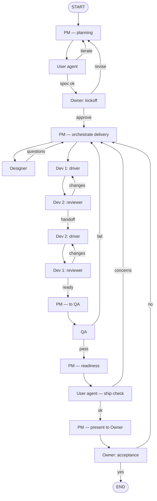

# LangGraph: product-team agent workflow (sketch)

This document sketches a **multi-agent LangGraph** where **you (Owner)** only ever interact with the **PM**—the **PM is the hub** that talks to **Designer**, **pair Devs**, **QA**, and the **User agent**. **PM ↔ User** loop on spec/plan; **PM** runs delivery after your kickoff; after **QA**, **PM** reports readiness, **User agent** does the ship check with **PM**, then **PM** brings you **acceptance**. Pair Devs stay on the driver/reviewer model.

## Roles (nodes)

| Agent   | Purpose (typical outputs in state) |
|--------|-------------------------------------|
| **PM** | **Orchestrator / your single interface.** Frames work, owns **spec**, talks to **Owner** (human). Delegates to **Designer**, **Devs**, **QA**, **User agent**; merges their outputs and decides next steps. **No other agent talks directly to Owner** in this model. |
| **Designer** | UX/UI intent, flows, constraints for engineering (and optional design tokens). |
| **Dev 1** | **Pair programmer** — alternates **driver** (writes/changes code) and **reviewer** (reviews Dev 2’s driver work). Same shared scope as Dev 2. |
| **Dev 2** | **Pair programmer** — same: alternates driver vs reviewer **vice versa** relative to Dev 1 (when one drives, the other reviews). |
| **QA** | Test plan, findings, severity, **pass/fail** gate. |
| **User** | **Agent** (not the human). **Interacts only with PM** (same as other specialists). Loops with **PM** on planning; after **QA**, ship-check with **PM**. **Does not** talk to Owner directly—PM summarizes for you. |
| **Owner** | **You** (human). **Only interacts with PM** (kickoff + acceptance + any steering). You never edge directly to Designer / QA / Devs / User in this graph; **PM** routes work and brings consolidated questions back to you. |

## Shared state (conceptual)

Use one graph **state** object (e.g. LangGraph `TypedDict` / `MessagesState` extension) that every node reads/updates:

- **`messages`** — conversation history (optional; useful with chat models).
- **`spec`** — PM-owned structured requirements.
- **`design`** — designer-owned artifacts (brief, wire-level notes, etc.).
- **`impl`** — dev-owned implementation notes or references (or tool call logs if agents use tools).
- **`pair_turn`** — whose turn it is to **drive** vs **review** (e.g. `dev1_drives` / `dev2_drives`), so the graph routes the next node correctly.
- **`review_feedback`** — latest reviewer output (requested changes, approval to hand off or go to QA).
- **`pair_round`** — optional counter to cap driver/review cycles (avoid infinite polish; or force QA / escalation).
- **`qa_report`** — findings, blockers, regression notes.
- **`pm_readiness_summary`** — short PM narrative after QA pass (“tests green, scope met,” etc.) for the **User agent ship check**.
- **`status`** — coarse phase: e.g. `planning | pm_user_loop | awaiting_owner_kickoff | designing | building | reviewing | pm_user_ship_check | awaiting_owner_acceptance | done`.
- **`gates`** — e.g. **`owner_kickoff`** (`pending | approved | needs_pm_revision`), **`owner_acceptance`** (`pending | ok | needs_rework`), **`user_agent_spec`** (`iterating | satisfied`), **`user_agent_ship`** (`pending | ok | concerns`), **`qa_result`**, `design_approved`.
- **`user_agent_notes`** — latest User-agent feedback (planning or post-QA “user lens” on PM’s test/readiness summary).
- **`owner_decision` / `owner_notes`** — your latest structured input at each Owner interrupt (approve vs revise; acceptance ok vs rework + reason).
- **`pm_owner_thread`** — optional scoped history for **Owner ↔ PM** only (keeps human channel clean).
- **`assignee_hints`** — optional; **PM** may set hints for **pair_turn** / who fixes what after QA triage.

Keep **immutable snapshots** in state if you need auditability (e.g. `spec_v2` after Owner kickoff revisions).

## Graph shape (recommended)

### Happy path

1. **ENTRY → PM** — ingest goal; draft **spec** (scope, acceptance criteria, open questions).
2. **PM ↔ User agent (planning loop)** — same as before; only **PM** sees **User** output. **You** only see **PM** (interrupt PM with **`owner_notes`** if you need to steer—PM then updates **spec** and/or re-runs **User**).
3. **PM → Owner (kickoff)** — PM presents plan/spec **to you**; you **approve to build** or **send PM back** (never another agent).
4. **PM → Designer** — after kickoff, **PM** delegates; Designer reads **spec** / PM brief, writes **`design`**.
5. **PM ↔ Designer** (optional) — if Designer needs clarification, **Designer → PM** (not Owner); PM may come **back to you** only if blocking product questions need Owner input.
6. **PM → pair programming** — **PM** hands off build instructions; pair loop runs (**Dev ↔ Dev** as before); **Devs** escalate to **PM** when stuck.
7. **Pair → QA** — **PM** can trigger / frame QA; **QA** reports to **state**; **QA** issues go **QA → PM** (PM sends back to pair/Designer).
8. **QA pass → PM (readiness)** — PM summarizes **qa_report**, **`pm_readiness_summary`**.
9. **PM ↔ User agent (ship check)** — User challenges or ok with **PM**; rework flows **PM →** whoever PM picks.
10. **PM → Owner (acceptance)** — PM packages “ready to ship”; you **accept** or **reject**; rejection is always **Owner → PM → …** (PM re-orchestrates).
11. **Owner (acceptance) → END** — when you accept.

### PM ↔ User agent (why it loops)

- Still **`PM → User → PM → …`** between **those two agents only**.
- **Owner** is **not** in that loop: you only **talk to PM**; PM may pause for **Owner** between iterations if you configure that.

### Owner checkpoints (your two main interrupts)

| When | What PM (or workflow) asks | Your outcomes → routing |
|------|----------------------------|-------------------------|
| **Before start** | **PM** shows you spec/plan (already refined with **User agent** off-thread). | **Approve** → **PM** starts **Designer** (or next delegate). **Reject** → **PM** only (PM updates spec / loops **User** again). |
| **After QA (agents)** | **PM + User agent** ship check; you are not in this loop. | **User agent** concerns → **PM** triages → **Designer** / **pair** / **QA** as PM decides. |
| **After PM says ready** | **PM** asks: accept delivery? | **Yes** → **done** (**Owner → PM** marks complete). **No** → **Owner → PM** with rework notes; **PM** routes work—**never** Owner → Designer/QA/Dev/User directly. |

**Optional gate:** **Designer** finishes → **PM** reviews → if needed **PM → Owner** for design approval → **PM** sends to **pair**. Still no **Designer → Owner** edge.

### Owner (human) vs PM vs User (agent)

- **Owner ↔ PM only** on the graph’s **human** edge.
- **PM ↔ User**, **PM ↔ Designer**, **PM ↔ QA**, **PM ↔ Devs** (via delegation / state handoffs)—specialists **do not** bypass PM to reach you.
- **You** are the real user in life; the **User agent** still gives PM a cheap “user voice” without requiring you on every micro-iteration.

### Pair programming loop (Dev 1 & Dev 2)

- **PM** starts/stops this phase and ingests results; **in-phase** behavior is still **Dev ↔ Dev** driver/reviewer.
- **One dev drives** (implements or applies changes); **the other reviews** that round—then **swap roles** for the next round (vice versa).
- **Reviewer outcomes** — conditional edges:
  - **Request changes** → hand back to the **current driver** (or switch driver if your policy says the reviewer fixes small nits—keep one rule and stick to it).
  - **Approve handoff** → **swap driver**: former reviewer becomes driver; run another implementation round, or if the slice is “done”, **→ PM** for QA handoff.
- **Exit to QA** — when PM triggers QA: e.g. “both have driven at least once **and** last review is approve”, or a **`pair_round`** cap; **QA** always reports back to **PM**.

### Loops (minimal but important)

- **User agent not satisfied** — only **PM** coordinates follow-up (then **PM** may engage Designer / pair / QA).
- **Owner kickoff / acceptance rejected** — **Owner → PM** only; **PM** updates plan or re-orchestrates.
- **QA fail** — **QA → PM** → **PM** → **pair** (or Designer) per triage.
- **Owner acceptance: not as expected** — **Owner → PM** with feedback; **PM** assigns rework (same as above).
- **Designer / Dev ambiguity** — **→ PM**; **PM** escalates to **Owner** only when PM cannot resolve alone.

## Mermaid diagram

*Every specialist path returns through **PM** except **Dev ↔ Dev** inside the pair loop. **Owner** only touches **PM**.*

## LangGraph mapping (implementation notes)

- **Hub pattern** — **`pm_node`** is the **only** neighbor of **`owner_node`** on the human side. **`user_agent_node`**, **`designer_node`**, **`qa_node`**, and **`dev_*`** only transition **to/from `pm_node`** (or each other for **pair** steps only).
- **Owner** — `interrupt` on **`pm_node`** when presenting kickoff/acceptance; state carries **`owner_decision`** back into **`pm_node`**.
- **Conditional edges** — rework from **Owner** always **→ `pm_node`**; **PM** subgraph or router decides **→ designer / qa / pair / user**.
- **Pair** — unchanged **driver/reviewer** edges between dev nodes; **entry/exit** of the pair phase is still **`pm_node`** (handoff in **`assignee_hints`** / **`spec`** slice).
- **User agent** — LLM; invoked by **PM** only.
- **Tools** — optional per role; **Owner** has none (only PM-facing messages).

## Suggested first milestone

1. **`owner_node` ↔ `pm_node` only**; **`pm_node` ↔ `user_agent_node`** planning loop.
2. **`pm_node`** wires **Designer → pair → QA**, always returning to **`pm_node`** after QA / ship check.
3. **Acceptance**: **`pm_node` → `owner_node` → `pm_node`** on reject.
4. Add **`pm_owner_thread`** and PM **triage** state for clean routing.

This file is a design sketch only; wire exact types and reducers when you add the LangGraph dependency and project layout.
